# LASPAI 智能体数据库设计方案

本文档描述 LASPAI 项目中智能体端（Agent Side）的数据库架构设计。数据库与网站本体共享同一 DBMS（暂定 MySQL），但表结构设计本身是 DBMS 无关的。数据库由文件管理服务器统一管理，作为唯一事实来源。智能体端内部直连访问，第三方通过 MCP 服务端代理。  
客户端使用 SQLAlchemy ORM 连接数据库，并通过 Alembic 自动生成迁移脚本以适应业务变更。文中的部分枚举类型 VARCHAR 在 DBMS 支持的情况下可以替换为 ENUM 类型，提高速度。

---

## 一、整体实体架构

本系统核心实体围绕「用户 → 对话 → 消息 → 工具调用」链路展开，同时管理 LLM 配置与化学数据制品。Agent 用户继承网站基础库的 User 实体，仅扩展 Agent 交互所需的字段。

```mermaid
erDiagram
    AgentUser ||--o{ Conversation : "发起"
    AgentUser ||--o{ LLMConfig : "配置"
    Conversation ||--o{ Message : "包含"
    Message ||--o{ ToolCall : "触发"
    ToolCall }o--o{ ArtifactState : "产出/引用"
    Message }o--o{ ArtifactState : "引用"
    ArtifactState }o--o{ FileRecord : "file_server_ids"

    AgentUser {
        string description "继承网站User，扩展Agent交互字段"
    }

    Conversation {
        string description "对话会话，含状态快照与HITL恢复数据"
    }

    Message {
        string description "对话历史条目，支持四种消息角色"
    }

    ToolCall {
        string description "MCP工具调用记录，含生命周期与链路追踪"
    }

    LLMConfig {
        string description "用户可配置多组LLM参数，加密存储密钥"
    }

    ArtifactState {
        string description "制品状态，JSON数组引用多条文件记录"
    }

    FileRecord {
        string description "物理文件元数据，含引用计数与TTL"
    }
```



**实体关系说明**：

| 关系 | 说明 |
| ---- | ---- |
| AgentUser → Conversation | 一个用户可发起多个对话 |
| Conversation → Message | 一个对话包含多条消息，按 `created_at` 排序还原历史 |
| ToolCall → ArtifactState | 计算工具产出 ArtifactState（如生成新分子），后续调用通过 `string_id` 引用已有制品 |
| Message → ArtifactState | 用户上传文件产生的 ArtifactState 关联到用户消息 |
| ArtifactState → FileRecord | M:N 关系，`file_server_ids` JSON 数组反范式存储；去重时多 artifact 共享同一文件 |

---

## 二、各表设计明细

### 2.1 agent_users — Agent 用户扩展

继承网站本体 User 表，仅存储 Agent 系统所需的扩展字段，避免侵入网站用户表结构。

```sql
CREATE TABLE agent_users (
    id                    VARCHAR(36) PRIMARY KEY,
    user_id               VARCHAR(36) NOT NULL UNIQUE,     -- 外键：网站用户
    default_llm_id           VARCHAR(36),                  -- 外键：LLM Config
    created_at            DATETIME NOT NULL DEFAULT CURRENT_TIMESTAMP,
    updated_at            DATETIME NOT NULL DEFAULT CURRENT_TIMESTAMP ON UPDATE CURRENT_TIMESTAMP,

    INDEX idx_agent_user_id (user_id)
);
```

### 2.2 conversations — 对话会话

每次用户发起对话即创建一条记录，承载对话元信息与 LangGraph 状态恢复数据。

```sql
CREATE TABLE conversations (
    id                  VARCHAR(36) PRIMARY KEY,
    user_id             VARCHAR(36) NOT NULL,              -- 外键：agent_users
    title               VARCHAR(255) DEFAULT '',           -- 对话标题（LLM 自动生成或用户编辑）
    inventory_snapshot  JSON,                              -- 当前 Artifact 库存摘要（供 LLM 上下文注入）
    checkpointer_state  BLOB,                              -- LangGraph 序列化状态，包含对话历史（HITL 中断恢复）
    message_count       INT DEFAULT 0,                     -- 冗余计数，列表排序用
    is_deleted          BOOLEAN DEFAULT FALSE,             -- 是否已删除
    created_at          DATETIME NOT NULL DEFAULT CURRENT_TIMESTAMP,
    updated_at          DATETIME NOT NULL DEFAULT CURRENT_TIMESTAMP ON UPDATE CURRENT_TIMESTAMP,
    deleted_at          DATETIME,                          -- 软删除时间

    INDEX idx_conv_user_id (user_id),
    INDEX idx_conv_user_status (user_id, status, updated_at DESC)
);
```

**设计要点**：

- `inventory_snapshot`：每轮对话结束时写入当前 Artifact 库存摘要，LLM 节点从该字段读取可用资源而非每次全表扫描
- `checkpointer_state`：HITL（人在回路）中断时写入 LangGraph 完整状态，用户恢复对话时直接反序列化继续执行
- `message_count`：冗余字段，避免列表查询时 JOIN 或 COUNT 子查询
- 软删除采用 `status = 'archived'` 而非 `is_deleted` 布尔值

### 2.3 messages — 对话历史条目

按时间顺序存储对话历史信息，用于在前端恢复对话历史。

```sql
CREATE TABLE messages (
    id                VARCHAR(36) PRIMARY KEY,
    conversation_id   VARCHAR(36) NOT NULL,                -- 外键：conversations
    content           MEDIUMTEXT,                          -- 消息正文
    parent_id         VARCHAR(36),                         -- 父消息 ID，用于处理层级关系
    token_count       INT DEFAULT 0,                       -- 该消息消耗的 Token 数
    metadata          JSON,                                -- 附件、引用 Artifact、来源、包含节点等
    created_at        DATETIME NOT NULL DEFAULT CURRENT_TIMESTAMP,

    INDEX idx_msg_conv_id (conversation_id),
    INDEX idx_msg_conv_created (conversation_id, created_at)
);
```

| 字段 | 适用角色 | 说明 |
| ---- | -------- | ---- |
| `content` | 全部 | 用户输入文本、AI 回复正文、工具执行结果 |
| `metadata` | 全部 | 灵活扩展：附件文件 ID、引用的 Artifact 短 ID 列表、来源标记等 |

**消息角色与存储模式**：

```text
一轮完整工具调用在 messages 表中的记录：
  user      ← "帮我优化这个分子"
  assistant ← content=null, tool_calls=[{id:"tc_1", name:"molecule_optimize", args:{...}}]
  tool      ← content="计算完成", tool_call_id="tc_1", metadata={artifact_ids:["mol_xyz"]}
  assistant ← content="优化完成，能量为 -100.5 eV..."
```

### 2.4 tool_calls — MCP 工具调用记录

追踪每一次 MCP 工具调用的完整生命周期，支撑调试、计费与性能分析。

```sql
CREATE TABLE tool_calls (
    id              VARCHAR(36) PRIMARY KEY,
    message_id      VARCHAR(36) NOT NULL,                  -- FK → messages（发起调用的 assistant 消息）
    tool_name       VARCHAR(128) NOT NULL,                 -- MCP 工具名，如 "molecule_generate"
    input_params    JSON,                                  -- 调用参数
    output_result   JSON,                                  -- MCP 返回结果
    artifact_ids    JSON,                                  -- 产出的 Artifact 短 ID 列表
    source          VARCHAR(16) DEFAULT 'third_party',             -- 用于区分是 Lasp Agent 直接调用还是第三方 LLM 调用
    status          VARCHAR(16) DEFAULT 'pending',         -- pending | running | success | error
    error_message   TEXT,                                  -- 错误详情
    trace_id        VARCHAR(64),                           -- 追踪 trace_id（关联 MCP Server 日志）
    created_at      DATETIME NOT NULL DEFAULT CURRENT_TIMESTAMP,
    updated_at      DATETIME NOT NULL DEFAULT CURRENT_TIMESTAMP ON UPDATE CURRENT_TIMESTAMP,

    INDEX idx_tc_message_id (message_id),
    INDEX idx_tc_trace_id (trace_id),
    INDEX idx_tc_status (status)
);
```

**设计要点**：

- `tool_name` 存的是 MCP 工具全名，可直接用于性能聚合（如统计各工具平均耗时）
- `artifact_ids` 存短 ID 数组，与 artifact_states 表解耦（不设外键，避免跨服务强依赖）
- `trace_id` 与 OpenTelemetry 体系对齐，用于跨服务调用链排查

### 2.5 llm_configs — LLM 配置

服务端预设多组 LLM（如 DeepSeek、Qwen等），在发起对话时选择或使用默认配置。
目前而言，预留作用大于实际作用，后续可支持更多 LLM 模型和厂商。

```sql
CREATE TABLE llm_configs (
    id                VARCHAR(36) PRIMARY KEY,
    name              VARCHAR(64) NOT NULL,                -- 配置名称（用户可见）
    provider          VARCHAR(64) NOT NULL,                -- deepseek | openai | ...
    model_name        VARCHAR(128) NOT NULL,               -- deepseek-chat / gpt-4o / ...
    api_endpoint      VARCHAR(255),                        -- 自定义 API 地址（为空则用系统默认）
    api_key_encrypted VARCHAR(512),                        -- 加密存储的 API Key
    config            JSON,                                -- {temperature, max_tokens, top_p, ...}
    credit_mult       FLOAT DEFAULT 1.0,                   -- 信用乘数，用于调整 Token 消耗
    created_at        DATETIME NOT NULL DEFAULT CURRENT_TIMESTAMP,
    updated_at        DATETIME NOT NULL DEFAULT CURRENT_TIMESTAMP ON UPDATE CURRENT_TIMESTAMP
);
```

### 2.6 artifact_states — 制品状态

记录化学制品的 Agent 侧状态信息。文件本体托管在文件管理服务器（有独立的元数据表），本表仅存储文件服务器引用 ID 及 Agent 系统所需的化学元数据。该表对应的是当前未重构版本的 `ChemicalData` 而不是 `Artifact`。

```sql
CREATE TABLE artifact_states (
    id                  INT AUTO_INCREMENT PRIMARY KEY,
    string_id           VARCHAR(32) NOT NULL UNIQUE,        -- 字符串ID，如 "mol_8f3a9b"
    file_server_ids     JSON,                               -- ["fs_aaa", "fs_bbb"] 多文件引用（反范式）
    type                VARCHAR(32) NOT NULL,               -- molecule | crystal | surface 等
    user_id             VARCHAR(36) NOT NULL,               -- 多用户户隔离
    summary             TEXT,                               -- 摘要描述，用于在不提供全文时给 LLM 提示文件的内容 
    chemical_metadata   JSON,                               -- 预留字段，如果计算软件支持，可给文件添加更多元数据
    parent_artifact_id  VARCHAR(36),                        -- 派生链（自引用，如优化后分子引用原始分子）
    source              VARCHAR(16) DEFAULT 'upload',       -- builtin | upload | computation
    is_deleted          BOOLEAN DEFAULT FALSE,             -- 是否已删除
    created_at          DATETIME NOT NULL DEFAULT CURRENT_TIMESTAMP,
    updated_at          DATETIME NOT NULL DEFAULT CURRENT_TIMESTAMP ON UPDATE CURRENT_TIMESTAMP,
    deleted_at          DATETIME,                          -- 软删除时间,

    INDEX idx_ast_string_id (string_id),
    INDEX idx_ast_user_id (user_id),
    INDEX idx_ast_user_type (user_id, type)
);
```

| 字段 | 说明 |
| ---- | ---- |
| `string_id` | Agent ↔ 文件服务器之间传递的唯一标识，对外不暴露数据库主键 |
| `file_server_ids` | JSON 数组，指向文件管理服务器的一条或多条文件记录。由于仅需从 artifact 查文件而无反向查询需求，采用反范式设计 |
| `source` | 区分内置（builtin）、用户上传（upload）和 MCP 计算产出（computation） |
| `is_deleted` / `deleted_at` | 软删除标记，所有引用该 artifact 的 conversation 消失后方可删除 |

**与 file_records 的关系（M:N）**：

一个 artifact 可包含多个文件（如 CIF + 参数 JSON），一个文件可被多个 artifact 引用（如重复上传同一文件）。`artifact_states.file_server_ids` 以 JSON 数组反范式存储引用。

```text
artifact_states                              file_records
──────────────                               ────────────
  string_id                                   id (PK)
  file_server_ids ──────[ "fs_a", ──────▶    filename
                          "fs_b" ]  ──▶      original_name
  type                                        size_bytes
  chemical_metadata (JSON)                    sha256
  parent_artifact_id                          ref_count
  source                                      last_accessed_at
```

Agent 读取文件时一次调用即可：`string_id → file_server_ids → 逐个查 file_records → 物理文件`。

### 2.7 生命周期管理

#### artifact_states 的删除

采用**引用计数**策略：当所有引用该 artifact 的 conversation 均被删除（`deleted_at IS NOT NULL`）后，标记该 artifact 为软删除。具体规则：

```text
清理条件：
  所有包含该 string_id 于 inventory_snapshot 中的 conversation
  均满足 deleted_at IS NOT NULL
  → 标记 artifact_states.deleted_at = NOW()
```

- `deleted_at` 仅标记，不立即物理删除，支持宽限期内的恢复
- 定期清理任务统一处理 `deleted_at` 超过宽限期（如 30 天）的记录

#### 物理文件的引用计数与过期

物理文件独立于 artifact 存在：删除文件不影响 artifact 记录，但文件必须被至少一个 artifact 引用才能保留。

| 规则 | 说明 |
|------|------|
| 引用计数 | `file_records.ref_count` = 引用该文件的 artifact 数量 |
| 减引用 | artifact 软删除或 `file_server_ids` 更新时，对应文件 `ref_count -= 1` |
| 零引用清理 | `ref_count = 0` 时立即删除物理文件及 `file_records` 记录 |
| TTL 过期 | 文件 `last_accessed_at` 超过 7 天未访问，即使 `ref_count > 0` 也触发物理删除 |
| 过期不删 artifact | TTL 删除只移除物理文件和 `file_records`，`artifact_states` 保留，`file_server_ids` 中对应 ID 标记为失效 |

```text
物理文件生命周期：

  上传 → ref_count >= 1, last_accessed_at = NOW()
   ↓
  每次下载 → 更新 last_accessed_at
   ↓
  ┌─ ref_count = 0 ──────────→ 立即删除物理文件 + file_records
  └─ last_accessed_at > 7天 ─→ TTL 过期，删除物理文件 + file_records
                                （artifact_states 保留，file_server_ids 标记失效）
```

TTL 检查由文件管理服务器的定时任务执行（如每小时扫描一次），无需 Agent 侧感知。

---

## 三、关键设计决策

| 决策 | 选择 | 理由 |
| ---- | ---- | ---- |
| 用户扩展 | 独立 `agent_users` 表 | 单向引用网站 User 表，保持与网站本体的松耦合，不侵入网站用户模型 |
| 消息存储 | 单表，单条查询 | 简化历史记录查询，同时避免 |
| ToolCall 与 Message 分离 | 独立 `tool_calls` 表 | `tool_calls` 表用于 MCP 服务端记录，`messages` 表用于Agent 侧消息记录，以实现 MCP 和官方 Agent 侧的分离 |
| ArtifactState 归属 | 归属 `user_id` 而非 `conversation_id` | 跨对话复用 |
| 短 ID 机制 | 带类型前缀的随机串 |  |
| 状态快照 | `inventory_snapshot` + `checkpointer_state` | 冗余写优化读：LLM 上下文注入无需实时聚合查询；HITL 恢复直接反序列化 |
| API Key 存储 | AES 或其他算法加密 | 应用层加密，满足安全合规要求 |
| 软删除 | `deleted_at` 字段记录删除时间，避免物理删除 | 语义更明确（active/archived），避免布尔值含义模糊 |
| 扩展性 | 预留JSON 字段 metadata | JSON 字段容纳未来新增属性，无需 DDL 变更 |
| 索引策略 | 复合索引覆盖高频查询 | `(user_id, status, updated_at)` 覆盖对话列表；`(user_id, type)` 覆盖制品筛选 |

---
