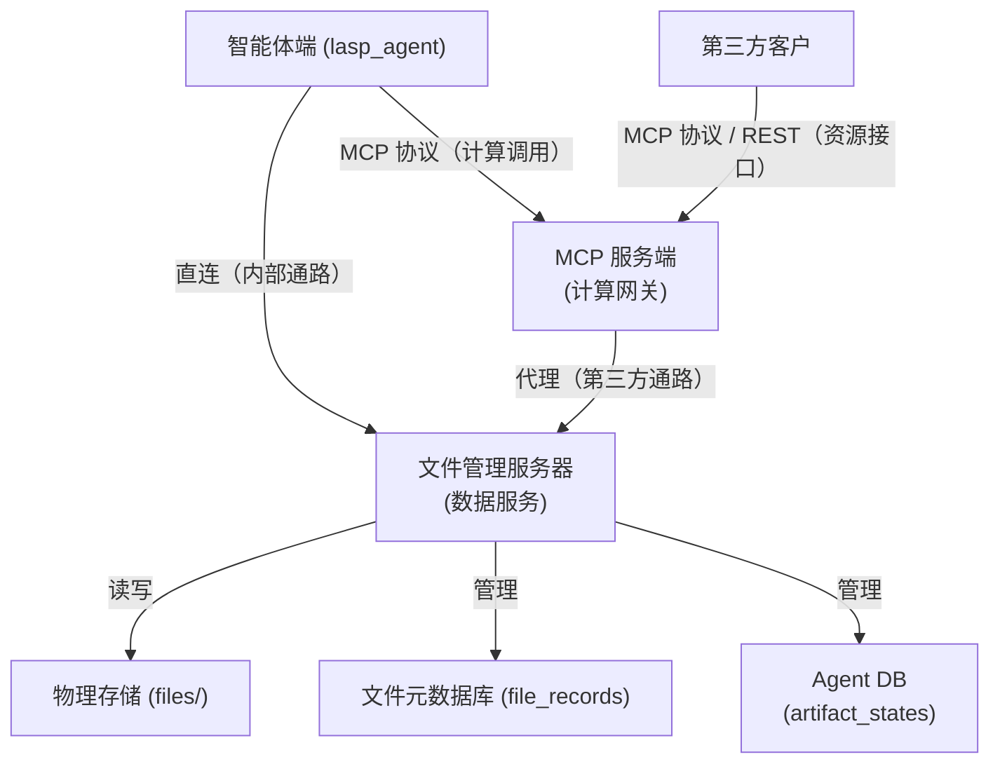
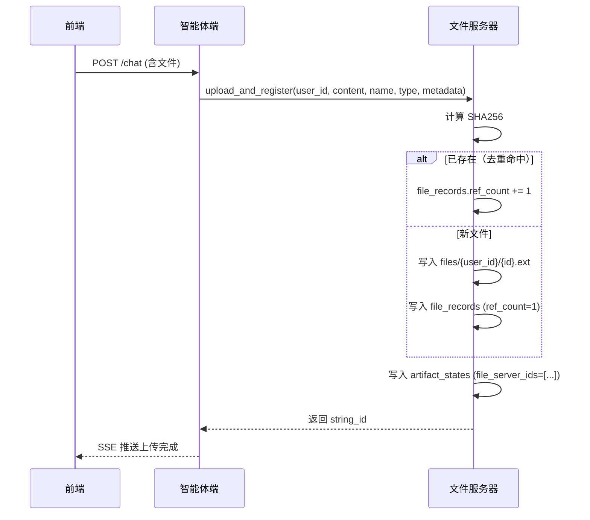
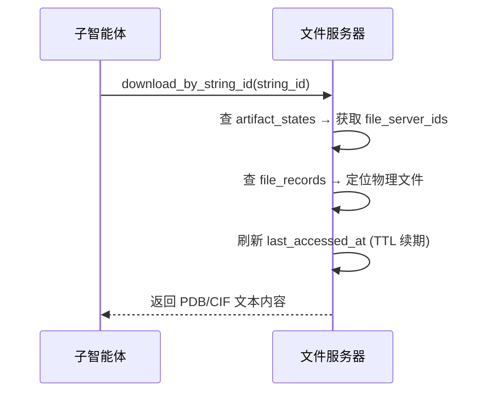

# LASPAI 智能体文件管理端设计方案

本文档描述 LASPAI 项目中文件管理服务器（File Server）的完整架构设计。文件服务器定位为 **数据服务**，统一管理物理文件存储、file_records 元数据以及 artifact_states 化学制品的全生命周期。客户端使用 SQLAlchemy ORM 连接数据库，通过 Alembic 管理 schema 迁移。

---

## 一、项目整体架构

文件管理端是 LASPAI 三层架构中的数据层，负责文件物理存储及所有相关元数据管理。智能体端内部直连访问；第三方客户通过 MCP 服务端代理。



**职责边界**：

| 组件 | 职责 | 不负责 |
|------|------|--------|
| 文件管理服务器（数据服务） | 物理存储、file_records、artifact_states 管理、去重、文件生命周期 | 化学计算调度 |
| MCP 服务端（计算网关） | 调度计算集群、tool call 路由；对外代理文件请求（第三方通路） | 物理存储、元数据管理 |

**双通路说明**：

```text
内部通路（Agent 直连）：
  lasp_agent ──直连──▶ 文件管理服务器     ← 上传/下载/查询一步完成，低延迟

外部通路（第三方经 MCP）：
  第三方 ──MCP/REST──▶ MCP 服务端 ──代理──▶ 文件管理服务器   ← 安全受控，统一鉴权
```

- 智能体端直连文件服务器完成所有数据操作（物理文件 + artifact_states）
- 第三方客户只能通过 MCP 服务端间接访问

---

## 二、物理存储设计

### 2.1 目录结构

采用 **user_id 一级目录** 的方案，和目前的处理方式保持对齐，最小化修改。

```text
files/
├── u_abc123/              # 用户目录（按 user_id）
│   └── b1c4d9e5.cif
├── u_def456/              # 文件少的用户：直接平铺
│   └── f83a9b2c.xyz
└── ...
```

| 设计要素 | 选择 | 理由 |
|---------|------|------|
| 次级目录 | `user_id` | 用户 ID 不变、不含特殊字符、天然隔离（删除用户 = 删除整个目录），加快查询速度 |
| 文件命名 | `{file_id}.{ext}` | 唯一、无冲突、易于定位 |
| 扩展名 | 保留原始扩展名 | 便于人工排查和工具识别 |

### 2.2 路径生成

```python
import os

def file_path(user_id: str, file_id: str, extension: str) -> str:
    """返回物理存储路径，自动创建所需目录。"""
    prefix = file_id[:2]
    path = os.path.join("files", user_id, prefix)
    os.makedirs(path, exist_ok=True)
    return os.path.join(path, f"{file_id}.{extension}")
```

如果未来迁移到对象存储（MinIO / S3），只需替换此函数的实现，数据库 schema 无需变动。

---

## 三、数据库设计

### 3.1 file_records — 文件元数据

`artifact_states` 与 `file_records` 为 M:N 关系：一个 artifact 可引用多个文件，一个文件可被多个 artifact 引用（去重场景）。引用关系通过 `artifact_states.file_server_ids` JSON 数组反范式存储。

```sql
CREATE TABLE file_records (
    id              VARCHAR(36) PRIMARY KEY,
    user_id         VARCHAR(36) NOT NULL,               -- 多用户隔离
    filename        VARCHAR(255) NOT NULL,              -- 物理文件名，如 a3b9c2d1.pdb
    original_name   VARCHAR(255),                       -- 用户上传时的原始文件名
    extension       VARCHAR(16),                        -- pdb / cif / xyz / mol / sdf
    size_bytes      INT,                                -- 文件大小
    sha256          VARCHAR(64),                        -- SHA256 哈希（去重 + 完整性校验）
    ref_count       INT DEFAULT 1,                      -- 引用计数（被几个 artifact 引用）
    last_accessed_at DATETIME,                          -- 最后访问时间（TTL 过期依据）
    created_at      DATETIME NOT NULL DEFAULT CURRENT_TIMESTAMP,

    INDEX idx_fr_user_id (user_id),
    INDEX idx_fr_sha256 (sha256),
    INDEX idx_fr_last_accessed (last_accessed_at)
);
```

| 字段 | 说明 |
|------|------|
| `id` | 主键，值存储在 `artifact_states.file_server_ids` JSON 数组中 |
| `user_id` | 多租户隔离，与 Agent 侧一致 |
| `filename` | 实际存储的文件名，由 file_id + extension 拼接 |
| `original_name` | 用户上传时的原始文件名，供展示和下载还原 |
| `sha256` | 写入后计算哈希，用于去重和完整性校验 |
| `ref_count` | 引用计数。上传/去重命中时 +1；artifact 删除或解除引用时 -1；归零时清理物理文件 |
| `last_accessed_at` | 每次下载时更新；超过 7 天未访问触发 TTL 过期删除 |

### 3.2 与 artifact_states 的关系（M:N）

```text
artifact_states                              file_records
──────────────                               ────────────
  string_id                                   id (PK)
  file_server_ids  ────[ "fs_a", ──────▶     filename
                         "fs_b" ] ────▶      original_name
  type                                        size_bytes
  chemical_metadata (JSON)                    sha256
  parent_artifact_id                          ref_count
  source                                      last_accessed_at
```

- `artifact_states.file_server_ids` 是 JSON 数组，存储一个或多个 `file_records.id`
- 仅需从 artifact 查文件，无反向查询需求，因此反范式设计可行
- 读取链路：`string_id → file_server_ids → 逐个查 file_records → 物理文件`

---

## 四、核心模块设计

### 4.1 文件上传（含去重 + artifact 创建）

一次调用完成物理存储、去重、`file_records` 和 `artifact_states` 写入，返回 `string_id`。去重命中时递增 `ref_count` 而非新建记录。

### 4.2 文件下载

按 `string_id` 一步完成查询和读取，同时刷新 `last_accessed_at` 以续期 TTL：

```python
    def download_by_string_id(self, string_id: str) -> bytes:
        artifact = db.query(ArtifactState).filter_by(string_id=string_id).first()
        if not artifact or not artifact.file_server_ids:
            raise FileNotFoundError(f"Artifact {string_id} not found")

        # 取第一个文件（通常只有一个）
        file_record = db.query(FileRecord).filter_by(
            id=artifact.file_server_ids[0]
        ).first()
        file_record.last_accessed_at = datetime.utcnow()  # TTL 续期
        db.commit()

        path = os.path.join("files", file_record.user_id,
                            file_record.filename[:2], file_record.filename)
        with open(path, "rb") as f:
            return f.read()
```

### 4.3 用户删除

删除用户时清理其全部物理文件和相关记录，各文件 `ref_count` 同步递减：

```python
    def delete_user_files(self, user_id: str):
        import shutil
        user_dir = os.path.join("files", user_id)
        if os.path.exists(user_dir):
            shutil.rmtree(user_dir)
        db.query(FileRecord).filter_by(user_id=user_id).delete()
        db.commit()
```

### 4.4 TTL 过期清理

定时任务（如每小时）扫描 `last_accessed_at` 超过 7 天的文件并清理。物理删除不影响 `artifact_states`：

```python
    def cleanup_expired_files(self, ttl_days: int = 7):
        cutoff = datetime.utcnow() - timedelta(days=ttl_days)
        expired = db.query(FileRecord).filter(
            FileRecord.last_accessed_at < cutoff
        ).all()

        for record in expired:
            path = os.path.join("files", record.user_id,
                                record.filename[:2], record.filename)
            if os.path.exists(path):
                os.remove(path)
            db.delete(record)
        db.commit()
```

> TTL 删除只移除物理文件和 `file_records` 记录，`artifact_states` 保留，其 `file_server_ids` 中对应 ID 标记为失效。

---

## 五、典型数据流

### 5.1 用户上传化学结构文件



### 5.2 MCP 工具调用中读取文件



---

## 六、关键设计决策

| 决策 | 选择 | 理由 |
|------|------|------|
| 物理存储 | 本地文件系统单目录平铺 + 次级目录 | 小型服务够用，零运维成本；子目录零成本防单目录膨胀 |
| 次级目录 | `user_id` 次级目录 | 用户 ID 不变、合法文件名；删除用户 = 删除目录 |
| 文件命名 | `{file_id}.{ext}` | UUID + 扩展名保证唯一且可读 |
| 去重 | SHA256 | 同文件只存一份，多 artifact_state 记录共享同一 file_server_id |
| 元数据分离 | `file_records` ≠ `artifact_states` | 存储信息与化学语义解耦，各自独立演进 |
| 预留升级空间 | 预留 `file_path()` 抽象 | 日后迁移 MinIO/S3 只需改这一行实现 |
| 不启用对象存储 | 暂不引入 MinIO/S3 | 当前规模不需要，过度设计徒增运维复杂度 |
| 大文件 | 不做分片 | 化学结构文件（PDB/CIF）通常 < 500KB，单次读写即可 |
| 生命周期 | 文件服务器统一管理 | 物理文件 + artifact_states 同生命周期，删除时一并清理 |
| 物理文件 TTL | 7 天未访问自动删除 | 定时任务扫描 `last_accessed_at`；删文件不删 artifact |
| Artifact ↔ File | M:N 关系 | 一个 artifact 可含多个文件；去重时一个文件被多个 artifact 引用 |
| 反范式 | `file_server_ids` JSON 数组 | 仅 artifact→file 方向查询，无需反向，JSON 数组更简单 |

---

## 七、与其他模块的协作协议

### 7.1 智能体端 ↔ 文件服务器（内部直连，统一入口）

智能体端所有数据操作通过文件服务器一步完成，不再跨服务拼接：

```text
智能体端                                              文件服务器
───────                                              ──────────
upload_and_register(user_id, content, ...)  ──────▶ 写物理文件 + file_records + artifact_states
                                                        → 返回 string_id
download_by_string_id(string_id)            ──────▶ 查 artifact_states → 查 file_records
                                                        → 读物理文件 → 返回 bytes
query_artifacts(user_id, type)              ──────▶ 查询 artifact_states → 返回列表
```

### 7.2 MCP 服务端 ↔ 文件服务器（代理 & 计算后写入）

第三方不直连文件服务器，通过 MCP 代理；MCP 自身计算产出也通过此通路写入：

```text
MCP 服务端                                              文件服务器
──────────                                              ──────────
代理上传（第三方请求）        ─────────────────────▶ upload_and_register(...) → 返回 string_id
代理下载（第三方请求）        ─────────────────────▶ download_by_string_id(...) → 返回 bytes
计算完成后写入               ─────────────────────▶ upload_and_register(..., source="computation")
```

### 7.3 两表关系映射

```text
artifact_states                                 file_records
──────────────                                  ────────────
file_server_id (FK)        ─────────────────▶  id (PK)
string_id                                      filename
chemical_metadata                               original_name
type                                           size_bytes
source                                         sha256
```

两表均由文件服务器管理，通过 `file_server_id` 关联。查询链路：`string_id → artifact_states → file_server_id → file_records → 物理文件`。

---

MCP 工具计算产出新文件时，调用 `upload()` 获取 `file_server_id`，再写入 `artifact_states` 记录。

---
