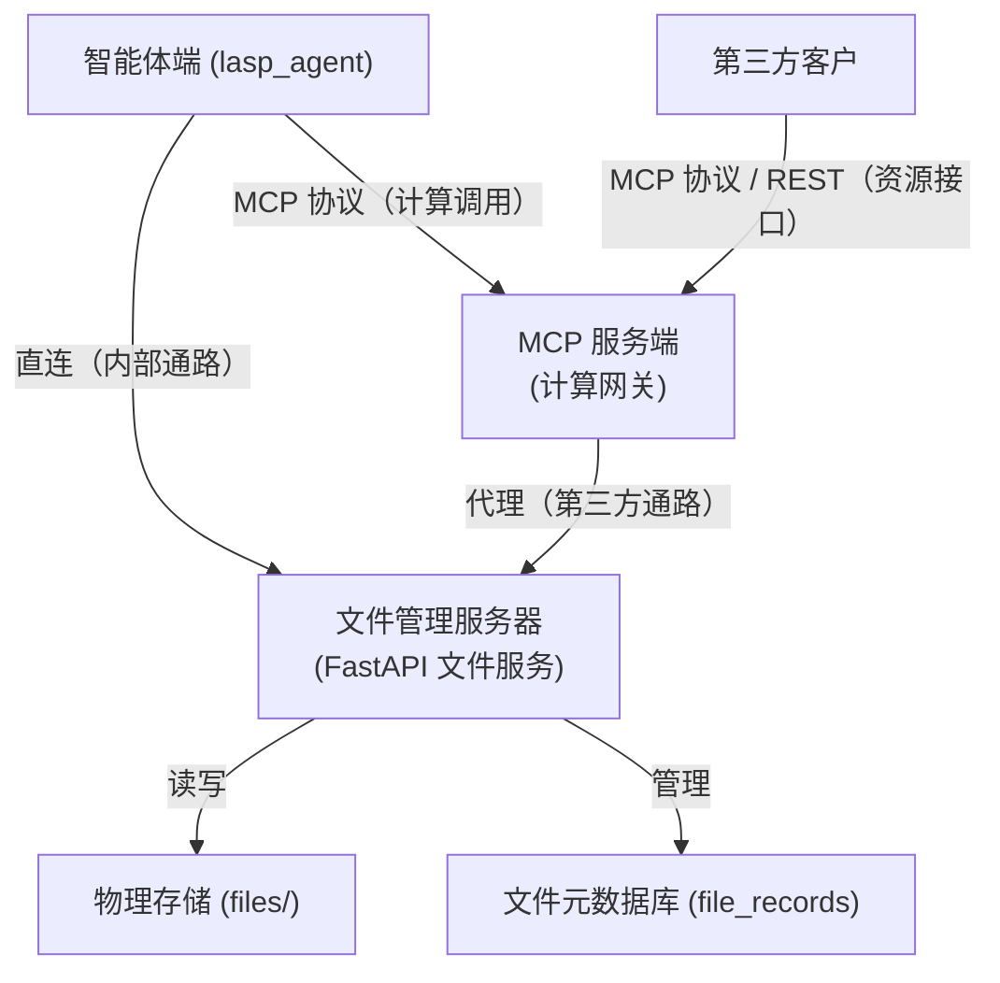
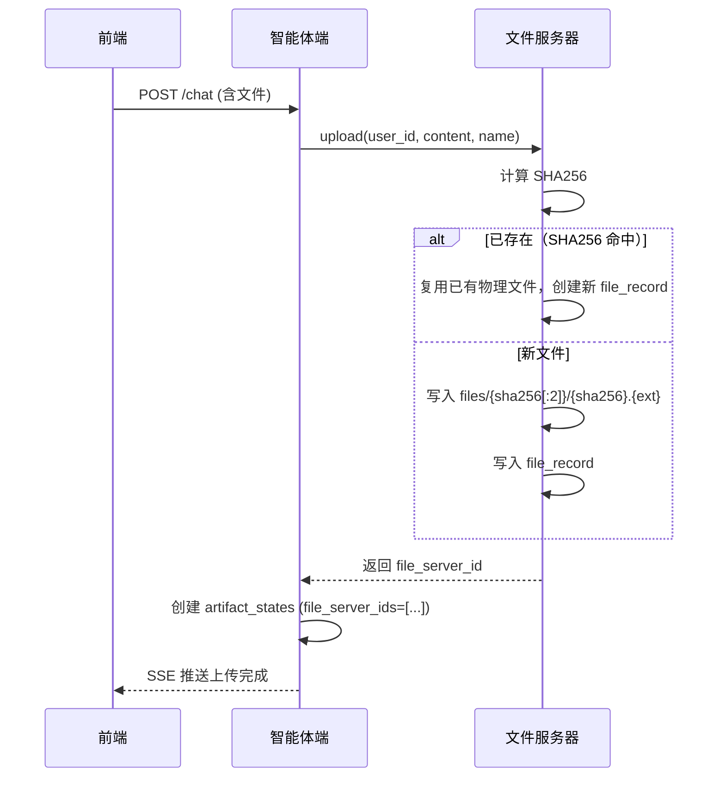
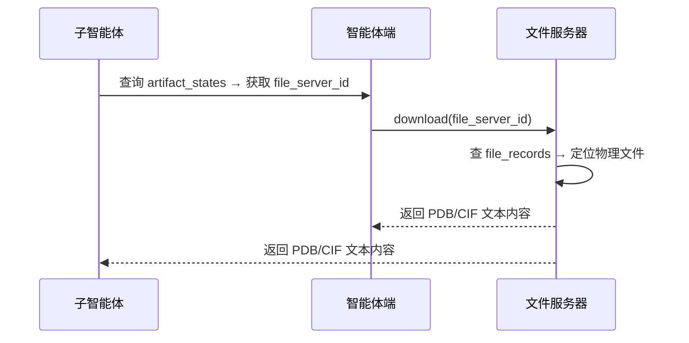

# LASPAI 智能体文件管理端设计方案

本文档描述 LASPAI 项目中文件管理服务器（File Server）的完整架构设计。文件服务器基于 FastAPI 构建，定位为轻量文件存储服务，统一管理物理文件存储与 file_records 元数据。artifact_states 化学制品由外部（Agent 端 / MCP 端）管理，文件服务器不感知。

---

## 一、项目整体架构

文件管理端负责化学结构文件的物理存储与 file_records 元数据管理。智能体端内部直连访问；第三方客户通过 MCP 服务端代理。



**职责边界**：

| 组件 | 职责 | 不负责 |
|------|------|--------|
| 文件管理服务器（FastAPI） | 物理存储、file_records 管理、SHA256 去重 | 化学语义、artifact_states 管理 |
| Agent 端 / MCP 端 | artifact_states 化学制品管理（string_id、元数据、派生链） | 物理文件路径管理 |

**双通路说明**：

```text
内部通路（Agent 直连）：
  lasp_agent ──直连──▶ 文件管理服务器     ← 上传/下载/查询一步完成，低延迟

外部通路（第三方经 MCP）：
  第三方 ──MCP/REST──▶ MCP 服务端 ──代理──▶ 文件管理服务器   ← 安全受控，统一鉴权
```

- 智能体端直连文件服务器完成文件上传/下载；artifact_states 由 Agent 端自行管理
- 第三方客户只能通过 MCP 服务端间接访问

### 1.1 目录结构

```text
lasp_file_server/
├── core/
│   ├── database.py                # 数据库引擎（管理全部业务表）
│   ├── models.py                  # ORM 模型（file_records / artifact_states 等）
│   └── storage.py                 # 物理存储抽象（file_path 等）
├── services/
│   └── file_service.py            # upload / download / delete_record
├── main.py
├── requirements.txt
└── .env
```

---

## 二、物理存储设计

### 2.1 目录结构

采用 **SHA256 内容寻址**，与 Git object store 同理。物理文件路径由内容哈希决定，天然去重，无需用户归属：

```text
files/
├── a3/
│   ├── a3b9c2d1e5f6789012345678901234567890abcd1234567890abcdef123456.pdb
│   └── a3f7e8a2c4d5e6789012345678901234567890abcd1234567890abcdef123456.cif
├── f8/
│   └── f83a9b2c4d5e6789012345678901234567890abcd1234567890abcdef123456.xyz
└── ...
```

| 设计要素 | 选择 | 理由 |
|---------|------|------|
| 寻址方式 | SHA256 前 2 字符 → 子目录 | 256 个桶均匀分布，防单目录膨胀 |
| 文件命名 | `{sha256}.{ext}` | 内容决定路径，多用户自动共享同一物理文件 |
| 用户隔离 | `file_records.user_id` 在数据库层 | 物理层不隔离，用户在 DB 层通过 record 归属区分 |

### 2.2 路径生成

```python
import os

def file_path(sha256: str, extension: str) -> str:
    """由 SHA256 计算物理路径：files/{前2位}/{完整sha256}.{ext}"""
    prefix = sha256[:2]
    path = os.path.join("files", prefix)
    os.makedirs(path, exist_ok=True)
    return os.path.join(path, f"{sha256}.{extension}")
```

如果未来迁移到对象存储（MinIO / S3），只需替换此函数的实现，数据库 schema 无需变动。

---

## 三、数据库设计

### 3.1 file_records — 文件元数据

`artifact_states` 与 `file_records` 为 M:N 关系。物理文件与 `file_records` 并非一一对应：多个 `file_records` 可指向同一物理文件（SHA256 相同），实现物理层去重而不依赖引用计数。

```sql
CREATE TABLE file_records (
    id              VARCHAR(36) PRIMARY KEY,
    user_id         VARCHAR(36) NOT NULL,               -- 多用户隔离
    filename        VARCHAR(255) NOT NULL,              -- 物理文件名 {sha256}.{ext}
    original_name   VARCHAR(255),                       -- 用户上传时的原始文件名
    extension       VARCHAR(16),                        -- pdb / cif / xyz / mol / sdf
    size_bytes      INT,                                -- 文件大小
    sha256          VARCHAR(64),                        -- SHA256 哈希（去重 + 完整性校验）
    created_at      DATETIME NOT NULL DEFAULT CURRENT_TIMESTAMP,

    INDEX idx_fr_user_id (user_id),
    INDEX idx_fr_sha256 (sha256)
);
```

| 字段 | 说明 |
|------|------|
| `id` | 主键，值存储在 `artifact_states.file_server_ids` JSON 数组中 |
| `user_id` | 多租户隔离，与 Agent 侧一致 |
| `filename` | 物理文件名 `{sha256}.{ext}`，同内容文件天然共享同一物理路径 |
| `original_name` | 用户上传时的原始文件名，供展示和下载还原 |
| `sha256` | 去重键：多 record 可共享同一物理文件；删除时按哈希计数决定是否清理物理文件 |

### 3.2 与 artifact_states 的关系（M:N）

```text
artifact_states                              file_records
──────────────                               ────────────
  string_id                                   id (PK)
  file_server_ids  ────[ "fs_a", ──────▶     filename
                         "fs_b" ] ────▶      original_name
  type                                        size_bytes
  chemical_metadata (JSON)                    sha256
  parent_artifact_id                          created_at
```

- `artifact_states.file_server_ids` 是 JSON 数组，存储一个或多个 `file_records.id`
- 仅需从 artifact 查文件，无反向查询需求，因此反范式设计可行
- 读取链路：`string_id → artifact_states → file_server_id → 文件服务器 → 物理文件`

---

## 四、核心模块设计

### 4.1 文件上传（SHA256 去重）

上传文件到物理存储并创建 `file_record`，返回 `file_server_id`。artifact_states 由调用方（Agent 端 / MCP 端）另行创建：

```python
import hashlib

class FileService:
    def upload(
        self, user_id: str, content: bytes,
        original_name: str,
    ) -> str:
        """上传文件，返回 file_server_id。不创建 artifact_states。"""
        sha256 = hashlib.sha256(content).hexdigest()
        ext = original_name.rsplit(".", 1)[-1] if "." in original_name else ""
        file_id = generate_uuid()

        # 物理层去重：相同 SHA256 的文件不重复写入
        physical_filename = f"{sha256}.{ext}"
        path = os.path.join("files", sha256[:2], physical_filename)
        if not os.path.exists(path):
            os.makedirs(os.path.dirname(path), exist_ok=True)
            with open(path, "wb") as f:
                f.write(content)

        record = FileRecord(
            id=file_id,
            user_id=user_id,
            filename=physical_filename,
            original_name=original_name,
            extension=ext,
            size_bytes=len(content),
            sha256=sha256,
        )
        db.add(record)
        db.commit()
        return file_id
```

调用方拿到 `file_server_id` 后自行创建 artifact_states（含 `string_id`、`chemical_metadata` 等）。

### 4.2 文件下载

按 `file_server_id` 读取，调用方需先从 artifact_states 获取 ID：

```python
    def download(self, file_server_id: str) -> bytes:
        record = db.query(FileRecord).filter_by(id=file_server_id).first()
        if not record:
            raise FileNotFoundError(f"Record {file_server_id} not found")
        path = os.path.join("files", record.filename[:2], record.filename)
        with open(path, "rb") as f:
            return f.read()
```

### 4.3 文件删除

删除 `file_record` 前检查是否仍有其他 record 指向同一物理文件，若无则一并删除物理文件。数据库操作在事务内完成，物理文件删除为 best-effort（失败由定期清理接管）：

```python
    def delete_record(self, record_id: str):
        with db.transaction():
            record = db.query(FileRecord).filter_by(id=record_id).first()
            if not record:
                return
            db.delete(record)
            remaining = db.query(FileRecord).filter_by(sha256=record.sha256).count()

        # 物理文件删除在事务外（文件系统无法回滚）
        if remaining == 0:
            path = os.path.join("files", record.filename[:2], record.filename)
            if os.path.exists(path):
                os.remove(path)
```

### 4.4 定期清理

定时任务（如每日）扫描 `artifact_states` 和 `conversations`，清理不再需要的物理文件：

```python
    def cleanup_orphan_files(self):
        """清理所属对话已删除或归档超期的物理文件。"""
        cutoff_deleted = datetime.utcnow() - timedelta(days=30)   # 软删除宽限期
        cutoff_archived = datetime.utcnow() - timedelta(days=7)   # 归档保留期

        orphan_artifacts = db.query(ArtifactState).join(Conversation).filter(
            or_(
                Conversation.deleted_at < cutoff_deleted,
                and_(Conversation.status == 'archived',
                     Conversation.updated_at < cutoff_archived),
            )
        ).all()

        for artifact in orphan_artifacts:
            for file_id in (artifact.file_server_ids or []):
                record = db.query(FileRecord).filter_by(id=file_id).first()
                if not record:
                    continue
                db.delete(record)
                # 物理文件只在无其他 record 引用时删除
                if db.query(FileRecord).filter_by(sha256=record.sha256).count() == 0:
                    path = os.path.join("files", record.filename[:2], record.filename)
                    if os.path.exists(path):
                        os.remove(path)
        db.commit()
```

> 清理依据为 conversation 状态，而非文件访问时间。物理文件删除后 artifact_states 保留，`file_server_ids` 中对应 ID 标记为失效。

---

## 五、典型数据流

### 5.1 用户上传化学结构文件



### 5.2 MCP 工具调用中读取文件



---

## 六、关键设计决策

| 决策 | 选择 | 理由 |
|------|------|------|
| 物理存储 | SHA256 内容寻址 `files/{sha256[:2]}/{sha256}.{ext}` | 内容决定路径，天然去重，多用户透明共享；256 桶均匀分布防膨胀 |
| 文件命名 | `{sha256}.{ext}` | 与 Git object store 同理，内容即地址 |
| 去重 | SHA256 物理层去重，不依赖引用计数 | 多 file_record 共享同一物理文件；删除时按 SHA256 计数判断是否清理 |
| 元数据分离 | `file_records`（FS 管）≠ `artifact_states`（外部管） | 文件服务器只管理存储元数据；化学语义由 Agent 端 / MCP 端各自管理 |
| 预留升级 | `file_path()` 抽象 | 迁移 MinIO/S3 只需改一行实现 |
| 大文件 | 不做分片 | 化学结构文件（PDB/CIF）通常 < 500KB，单次读写即可 |
| 框架 | FastAPI | 与 Agent 端和 MCP 端技术栈一致 |
| 生命周期 | 文件服务器只管 file_records；物理文件跟随 record | artifact_states 外部管理；物理文件在无 record 引用时由定期清理移除 |
| 文件清理 | 基于 conversation 状态定期清理 | 对话删除 30 天或归档 7 天后清理；不使用引用计数 |
| Artifact ↔ File | M:N，`file_server_ids` JSON 数组反范式 | 仅 artifact→file 方向查询，无需反向 |
| 一致性 | DB 事务 + 物理文件 best-effort | DB 层原子提交；物理文件失败由定期清理最终一致 |

---

## 七、与其他模块的协作协议

### 7.1 智能体端 ↔ 文件服务器（内部直连）

```text
智能体端                                              文件服务器
───────                                              ──────────
upload(user_id, content, name)         ──────────▶ 写物理文件 + file_record → 返回 file_server_id
download(file_server_id)               ──────────▶ 查 file_record → 读物理文件 → 返回 bytes
```

上传完成后，智能体端自行创建 artifact_states（string_id、chemical_metadata 等），关联返回的 file_server_id。

### 7.2 MCP 服务端 ↔ 文件服务器（代理 & 计算后写入）

第三方不直连文件服务器，通过 MCP 代理：

```text
MCP 服务端                                              文件服务器
──────────                                              ──────────
代理上传（第三方请求）        ─────────────────────▶ upload(...) → 返回 file_server_id
代理下载（第三方请求）        ─────────────────────▶ download(...) → 返回 bytes
计算完成后写入               ─────────────────────▶ upload(...)，artifact_states 由 MCP 自行创建
```

### 7.3 artifact_states ↔ file_records 关系映射

```text
artifact_states （外部管理）                 file_records （FS 管理）
───────────────────────                    ───────────────────────
  string_id                                  id (PK)
  file_server_ids  ───────[ "fs_a" ]───▶    filename
  type                                       original_name
  chemical_metadata (JSON)                   size_bytes
  parent_artifact_id                         sha256
  source
```

两表通过 `file_server_ids` 关联。查询链路：`string_id → artifact_states → file_server_id → 文件服务器 → 物理文件`。

---

MCP 工具计算产出新文件时，调用 `upload()` 获取 `file_server_id`，再写入 `artifact_states` 记录。

---
