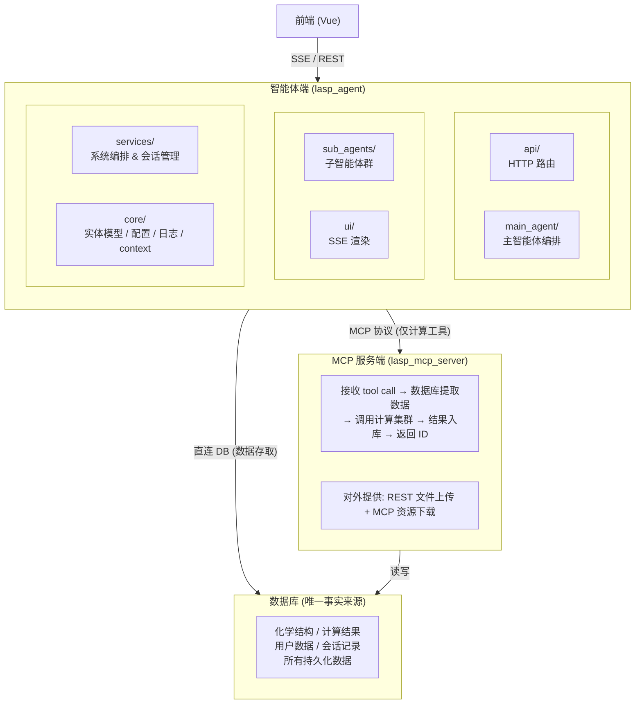
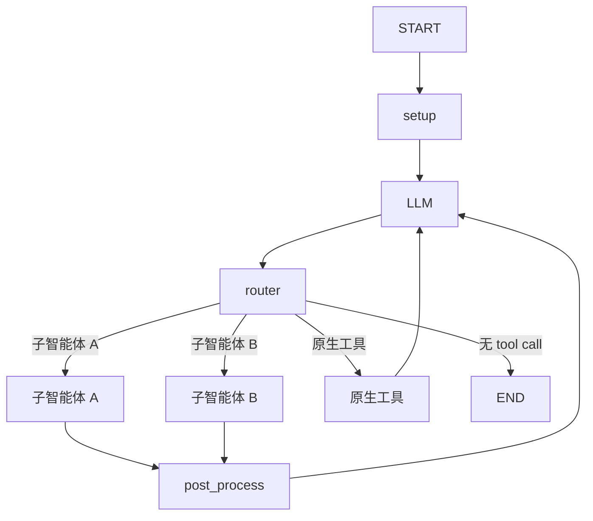

# LASPAI 智能体端设计方案

本文档描述 LASPAI 项目中智能体端（Agent Side）的完整架构设计，涵盖模块划分、分层职责、数据流以及与 MCP 服务端、数据库的协作方式。

---

## 一、项目整体架构

项目由三个独立部分组成：



**职责边界**：

| 层级       | 职责                                                               | 不负责                       |
| ---------- | ------------------------------------------------------------------ | ---------------------------- |
| 智能体端   | 理解用户意图、编排工具调用、生成回复、SSE 推送、**直接存取数据库** | 计算执行                     |
| MCP 服务端 | 暴露标准化计算工具、调用计算集群、结果入库；对外提供文件上传/下载  | 对话管理、意图理解、前端交互 |
| 数据库     | 存储所有持久化数据，智能体端和 MCP 服务端共享同一数据库            | 业务逻辑、计算逻辑           |

---

## 二、智能体端目录结构

```text
lasp_agent/
├── server.py                         # 应用入口：组装 FastAPI，挂载中间件与路由
│
├── api/                              # HTTP 接口层
│   ├── __init__.py
│   ├── deps.py                       # 鉴权依赖（get_user_id, verify_session_ownership 等）
│   ├── schemas.py                    # 请求/响应 Pydantic 模型
│   └── routers/
│       ├── __init__.py
│       ├── chat.py                   # SSE 连接 / Chat / Resume / Stop / Inventory / File 端点
│       ├── sessions.py               # 会话 CRUD
│       ├── llm_config.py             # 用户自定义 LLM 配置
│       └── parse.py                  # 文件解析端点
│
├── core/                             # 纯基础设施层（不依赖 api / services / main_agent / sub_agents）
│   ├── __init__.py
│   ├── config/
│   │   ├── __init__.py
│   │   ├── env_settings.py           # 环境变量加载（DEEPSEEK_API_KEY, WORKSPACE_DIR, MCP_SERVER_URL 等）
│   │   ├── models.py                 # LLM 模型工厂（默认模型 + 用户自定义模型）
│   │   ├── paths.py                  # 工作目录路径常量
│   │   └── setup_logging.py          # 日志配置（含 OTel trace/span 上下文自动注入的 Formatter）
│   ├── entities/                     # 化学数据实体模型（按领域拆分）
│   │   ├── __init__.py               # re-export 所有实体，保持外部 import 路径稳定
│   │   ├── base.py                   # BaseData 抽象基类、Artifact、ArtifactSummary
│   │   ├── molecule.py               # MoleculeData
│   │   ├── crystal.py                # CrystalData、SurfaceData、AdsorptionData
│   │   ├── phonon.py                 # PhononData
│   │   ├── spectral.py               # SpectralData
│   │   ├── md.py                     # MDData
│   │   ├── go.py                     # GOData
│   │   ├── collection.py             # DataCollection
│   │   └── helpers.py                # _parse_abc、_normalize_abc 等纯辅助函数
│   ├── database.py                   # 业务数据库引擎 + 化学数据存取（直连数据库，不走 MCP）
│   ├── checkpointer.py               # 自定义 LangGraph checkpointer（覆盖模式）
│   ├── telemetry.py                  # OpenTelemetry 初始化：TracerProvider、自动插桩注册（FastAPI/LangChain/SQLAlchemy）
│   ├── context.py                    # contextvars：user_id、user_token 上下文变量
│   └── mcp_client.py                 # 异步 MCP 客户端：连接管理、tool call、traceparent 透传
│
├── services/                         # 应用编排层
│   ├── __init__.py
│   ├── system.py                     # AgentSystem：组装 SubAgentManager + MainToolManager + UIManager
│   └── session.py                    # SessionHandler：单会话生命周期、LangGraph 事件→SSE 转换、持久化
│
├── main_agent/                       # 主智能体（对话编排与工具路由）
│   ├── __init__.py
│   ├── graph.py                      # LangGraph 图定义：setup → LLM → router → post_process（全部 async）
│   ├── state.py                      # MainAgentState：messages, inventory, tool_call, sub_input/output
│   ├── prompts.py                    # ROUTER_PROMPT（系统提示词）
│   ├── constants.py                  # BasicMainNode 枚举
│   ├── utils.py                      # resolve_artifacts、_sanitize_messages
│   ├── llm_presenter.py              # LLM / SETUP / POST_PROCESS 节点的 UI Handler 配置
│   └── tools/                        # 主智能体原生工具（如 reader）
│       ├── __init__.py
│       ├── base.py                   # BaseTool Pydantic 基类、MainToolBlueprint 抽象类
│       ├── manager.py                # MainToolManager：插件发现与注册
│       └── reader/
│           ├── __init__.py
│           └── reader.py             # reader 工具实现（读取资源内容供 LLM 阅读）
│
├── sub_agents/                       # 子智能体群（各自独立的 LangGraph，仅工具调用层统一）
│   ├── __init__.py
│   ├── manager.py                    # SubAgentManager：插件发现、注册、tool schema 汇总
│   ├── base/                         # 子智能体公共基类
│   │   ├── __init__.py
│   │   ├── blueprint.py              # SubAgentBlueprint 抽象接口
│   │   ├── nodes.py                  # 通用节点：common_start_node, common_router_node, common_end_node
│   │   └── state.py                  # BaseSubAgentState（含协议字段 + 执行跟踪字段）
│   ├── mol_agent/                    # 小分子智能体（0D 孤立体系）
│   │   ├── __init__.py
│   │   ├── blueprint.py              # 注册信息 + tool_schema + ui_handler
│   │   ├── graph.py                  # 独有图结构（含画板中断流程）
│   │   ├── state.py                  # MolAgentState
│   │   ├── prompts.py                # 各节点提示词
│   │   ├── schemas.py                # LLM 结构化输出模型
│   │   ├── constants.py              # 节点枚举、重试次数等
│   │   └── presenter.py              # UI 渲染配置
│   ├── crys_agent/                   # 晶体智能体（含批量生成 + 择优流程）
│   ├── surf_agent/                   # 表面智能体（切面 + 固定原子层）
│   ├── adsorp_agent/                 # 吸附智能体（多结构协调）
│   ├── prop_agent/                   # 性质计算智能体（振动/声子/光谱）
│   ├── md_agent/                     # 分子动力学智能体
│   ├── go_agent/                     # 全局优化智能体
│   └── db_query_agent/               # 数据库查询智能体
│
├── ui/                               # 前端交互适配层
│   ├── __init__.py
│   ├── manager.py                    # UIManager：按 node_name + current_agent 路由 handler
│   ├── sse_adapter.py                # SSEAdapter：SSE 帧格式化 + asyncio.Queue 推送
│   └── base/
│       ├── __init__.py
│       ├── handler.py                # BaseUIHandler 及其子类（SubNode / Agent / MainNode）
│       ├── state.py                  # UIState, NodeStatus, StepStatus, UpdateStrategy
│       ├── element.py                # UI 元素组件（Ketcher / Structure / Chart 等）
│       └── artifact_helper.py        # ArtifactListElement 构建辅助
│
├── ask_service/                      # 智能问答服务（RAG 模式）
│   ├── __init__.py
│   ├── data/                         # 问答知识库文档（PDF/TXT/JSON）
│   ├── doc_loader.py                 # 文档加载与索引
│   ├── graph.py                      # 问答 LangGraph
│   └── prompts.py                    # 问答提示词
│
├── utils/                            # 跨模块通用工具
│   ├── __init__.py
│   └── thermo_formatter.py           # 热化学数据格式化
│
├── requirements.txt
└── .env
```

---

## 三、分层职责详解

### 3.1 `core/` — 纯基础设施

最底层，不 import `api/`、`services/`、`main_agent/`、`sub_agents/` 中的任何模块。

| 子模块            | 职责                                                                                                                                 |
| ----------------- | ------------------------------------------------------------------------------------------------------------------------------------ |
| `config/`         | 环境变量加载、LLM 模型工厂、工作目录路径、日志格式化器（含 OTel trace/span 上下文注入）                                              |
| `entities/`       | 化学数据实体模型。保留 `read()` / `get_summary()` / `export_metadata()` / `read_file()` 等业务方法，底层数据访问切换为直接数据库查询 |
| `database.py`     | 业务数据库引擎 + 化学数据直接存取。智能体端不绕 MCP，直接读写数据库                                                                  |
| `checkpointer.py` | 自定义 LangGraph checkpointer（覆盖模式），替代原生 `AsyncSqliteSaver`                                                               |
| `telemetry.py`    | OpenTelemetry SDK 初始化：TracerProvider 配置、FastAPI / LangChain / SQLAlchemy 自动插桩注册、W3C traceparent 传播器                 |
| `context.py`      | `contextvars` 定义：`user_id_var`、`user_token_var`。被 `api/deps.py` 鉴权依赖写入、被业务模块读取以注入 Span Attributes             |
| `mcp_client.py`   | 异步 MCP 客户端。提供 `call_tool(name, args) -> dict` 和 `list_tools()`。通过 OTel propagator 自动注入 `traceparent` Header          |

### 3.2 `services/` — 应用编排

依赖 `core/`、`main_agent/`、`sub_agents/`、`ui/`，负责「把零件组装起来并跑起来」。

| 子模块       | 职责                                                                                                                                |
| ------------ | ----------------------------------------------------------------------------------------------------------------------------------- |
| `system.py`  | AgentSystem：创建 `SubAgentManager` + `MainToolManager`，编译 `main_agent` 和 `ask_graph`，组装 `UIManager`                         |
| `session.py` | SessionHandler：管理单会话生命周期，通过 `astream_events` 驱动 LangGraph，将事件转换为 SSE 推送，持久化消息记录，处理 HITL 中断恢复 |

### 3.3 `main_agent/` — 主智能体

接收用户消息，维护 `inventory`（资源库存），通过 LLM 决定调用哪个子智能体或原生工具。

**图结构**：



**关键设计**：

- **全部节点 async**：`setup_node`、`LLM_node`、`router_node`、`post_process_node` 均为 `async def`
- **Inventory**：`MainAgentState.inventory: dict[str, Artifact]`，每个 `Artifact` 持有短 ID + 元数据摘要 + 可选懒加载的 `data` 字段。LLM 节点将 inventory 摘要注入系统提示词，供 LLM 了解当前可用资源
- **Router**：根据 LLM 返回的 `tool_calls` 决定跳转——子智能体名 → 进入子图；原生工具名 → 执行后回到 LLM；无调用 → 结束
- **Post-process**：子智能体执行完毕后，将其输出的 `Artifact` 注册到 inventory，生成 `ToolMessage` 回执

### 3.4 `sub_agents/` — 子智能体群

每个子智能体是一个独立的 LangGraph 图，拥有自己的领域状态、提示词、执行节点和 UI 配置。**图结构各自独立，不强制统一**。

**共性**（由 `base/` 提供）：

| 组件                 | 说明                                                                                      |
| -------------------- | ----------------------------------------------------------------------------------------- |
| `SubAgentBlueprint`  | 抽象接口：`name` / `tool_schema` / `ui_handler` / `build_graph(mcp_client)`               |
| `common_start_node`  | 通用入口：设置 `run_id`、`run_dir`，解析 `SubAgentInput`                                  |
| `common_router_node` | 通用路由：按 `plans[plan_index][step_index]` 逐步跳转，处理错误重试                       |
| `common_end_node`    | 通用出口：构造 `SubAgentOutput`                                                           |
| `BaseSubAgentState`  | 通用状态基类：`sub_input/output`、`plans`、`plan_index`、`step_index`、`error_history` 等 |

**个性**（以 mol_agent 为例）：

- 独有节点：`init_node`（SMILES 提取）、`request_draw_node`（HITL 画板中断）、`process_mol_node`、`generate_node`、`optimize_node`、`properties_node`、`pack_node`
- 独有状态字段：`smiles`、`request_draw`、`current_mol_data` 等
- 独有流程：`init → (request_draw →) process_mol → planner → router → generate/optimize/properties → pack → end`

**所有执行节点统一通过 `MCPClient` 调用计算能力**，不再各自维护 Service 类：

```python
# 之前：每个子智能体有自己的 Service 类
mol_services = MoleculeServices(client)
result = mol_services.generate(mol_block)

# 之后：统一通过 MCP Client
result = await mcp_client.call_tool("molecule_generate", {"mol": mol_block})
```

### 3.5 `ui/` — 前端交互适配

职责：将 LangGraph 运行时事件翻译为前端可消费的 SSE 消息。

| 子模块                    | 职责                                                                                                                    |
| ------------------------- | ----------------------------------------------------------------------------------------------------------------------- |
| `sse_adapter.py`          | 将 `UIState` 序列化为 SSE 帧（`event: node_update\ndata: {...}\n\n`），通过 `asyncio.Queue` 异步推送                    |
| `manager.py`              | 根据 `node_name` + `current_agent` 查找对应的 `UIHandler`                                                               |
| `base/handler.py`         | Handler 类层次：`SubNodeUIHandler`（底层节点）、`AgentUIHandler`（子智能体父节点）、`MainNodeUIHandler`（主智能体节点） |
| `base/state.py`           | UI 状态模型：`UIState`、`NodeStatus`（后端生命周期）、`StepStatus`（前端生命周期）、`UpdateStrategy`                    |
| `base/element.py`         | 富交互组件：`KetcherElement`（分子绘制）、`StructureElement`（3D 结构）、`PhononChartElement` 等                        |
| `base/artifact_helper.py` | 将 `output_artifacts` 统一转换为 `ArtifactListElement`                                                                  |

该模块不依赖 MCP，仅弱依赖 `core/entities`（`ArtifactSummary`），路径通过 `entities/__init__.py` re-export 保持稳定。

### 3.6 `ask_service/` — 智能问答

独立的 RAG 问答通道，使用 `langchain` 文档加载 + 向量检索。知识库文档存放在 `ask_service/data/` 子目录中，与 MCP 管理的化学计算数据物理隔离。

---

## 四、核心模块详细设计

### 4.1 MCP Client（`core/mcp_client.py`）

统一的异步 MCP 协议客户端，**仅用于计算工具调用**。数据存取方面，智能体端直接连接数据库。

```python
class MCPClient:
    """异步 MCP 客户端"""

    def __init__(self, server_url: str):
        self.server_url = server_url
        self._session: ClientSession | None = None
        self._propagator = TraceContextTextMapPropagator()

    async def connect(self):
        """建立与 MCP Server 的 SSE 长连接"""

    async def disconnect(self):
        """关闭连接"""

    async def call_tool(self, name: str, arguments: dict) -> dict:
        """
        调用 MCP 工具。
        通过 OTel propagator 自动将当前 Span Context 注入 traceparent Header。
        返回计算结果（含新生成的短 ID 和元数据）。
        """

    async def list_tools(self) -> list[dict]:
        """获取 MCP Server 提供的所有工具列表（供 LLM function calling 使用）"""
```

**关键设计点**：

- **仅负责计算**：MCPClient 只调用计算工具（生成、优化、振动分析等），不用于数据存取
- **数据存取直连 DB**：智能体端通过 `core/database.py` 直接读写数据库（与 MCP Server 共享同一数据库），无需绕路 MCP
- **单例生命周期**：`MCPClient` 在 `AgentSystem` 初始化时创建，注入给所有子智能体，应用关闭时断开
- **traceparent 透传**：每次 `call_tool` 通过 OTel 的 `inject()` 自动将当前 trace context 注入 HTTP `traceparent` Header，MCP Server 端继承同一 `trace_id`
- **连接复用**：所有子智能体共享同一个 SSE 连接，避免重复建连开销

### 4.2 全链路追踪 — OpenTelemetry（`core/telemetry.py` + `core/config/setup_logging.py` + `core/mcp_client.py`）

采用 OpenTelemetry SDK 实现无侵入自动插桩，废止自定义 `request_id`，改用 W3C `traceparent` 标准协议。

**技术栈**：

| 组件                                       | 说明                                       |
| ------------------------------------------ | ------------------------------------------ |
| `opentelemetry-sdk`                        | TracerProvider、SpanProcessor、日志桥接    |
| `opentelemetry-instrumentation-fastapi`    | 自动为每个 HTTP 请求创建 Span              |
| `opentelemetry-instrumentation-langchain`  | 自动为 LLM 调用、Chain/Graph 执行创建 Span |
| `opentelemetry-instrumentation-sqlalchemy` | 自动为数据库查询创建 Span                  |
| `opentelemetry-propagator-tracecontext`    | W3C `traceparent` Header 格式传播器        |

**初始化（`core/telemetry.py`）**：

```python
from opentelemetry import trace
from opentelemetry.sdk.trace import TracerProvider
from opentelemetry.sdk.trace.export import BatchSpanProcessor, ConsoleSpanExporter
from opentelemetry.instrumentation.fastapi import FastAPIInstrumentor
from opentelemetry.instrumentation.langchain import LangchainInstrumentor
from opentelemetry.instrumentation.sqlalchemy import SQLAlchemyInstrumentor
from opentelemetry.propagators.tracecontext import TraceContextTextMapPropagator
from opentelemetry.propagate import set_global_textmap

def init_telemetry(service_name: str = "lasp_agent"):
    # 1. 配置 TracerProvider（暂不部署 APM，仅 Console 输出）
    provider = TracerProvider()
    provider.add_span_processor(BatchSpanProcessor(ConsoleSpanExporter()))
    trace.set_tracer_provider(provider)

    # 2. 设置 W3C traceparent 传播器（废弃自定义 X-Request-Id Header）
    set_global_textmap(TraceContextTextMapPropagator())

    # 3. 自动插桩在 server.py 中调用（无侵入）
    # FastAPIInstrumentor().instrument_app(app)
    # LangchainInstrumentor().instrument()
    # SQLAlchemyInstrumentor().instrument()
```

**Span Attributes 业务维度绑定**：

| 属性         | 来源                               | 说明                         |
| ------------ | ---------------------------------- | ---------------------------- |
| `user_id`    | `api/deps.py` 鉴权依赖             | 多租户数据隔离、计费拦截排查 |
| `session_id` | `POST /chat/{session_id}` 路径参数 | 对话窗口追踪、多轮上下文关联 |

不再使用 `run_id`（与 LangGraph 内部 run 概念冗余，`session_id` + `user_id` 已足够定位到具体执行）。

**SSE 不参与 Trace**：

SSE 连接（`GET /sse/chat/{session_id}`）仅为单向推送管道，**不为其创建 Span**。业务链路的 Root Span 挂在 `POST /chat/{session_id}` 上——用户发消息触发图运行时开启 Trace，SSE 仅负责将运行时事件推送给前端，无需维持长时巨型 Span。

**跨服务透传**：

`mcp_client.py` 的 `call_tool` 方法通过 OTel 的 `inject()` 自动将当前 Span Context 写入 HTTP Header：

```python
from opentelemetry.propagate import inject

async def call_tool(self, name: str, arguments: dict) -> dict:
    headers = {}
    inject(headers)
    # 自动写入: traceparent: 00-{trace_id}-{span_id}-01
    # HTTP 请求携带 headers
```

MCP Server 收到请求后解析 `traceparent`，有则继承 `trace_id` 成为子 Span，无则（第三方 REST 直接调用）自动生成全新 Root Span。

**日志输出格式**：

配置 OTel 将 trace/span 上下文桥接到 Python `logging`，Console 输出格式：

```text
2026-07-05 14:32:01 | trace=af3b9c2d1 | span=8e4f7a1b | user=u_123 | session=s_456 | lasp_agent.main_agent.graph | INFO | >>> Executing Router...
```

初期不部署 Jaeger / Tempo 等 APM，通过 `grep trace=af3b9c2d1` 即可快速排查跨服务链路。

**全链路追踪范围**：

```text
POST /chat/{session_id}  → Root Span (FastAPIInstrumentor 自动创建)
  │  Span Attributes: user_id=u_123, session_id=s_456
  │
  ├─ chat.py 路由处理 (auto-span)
  │   └─ 文件写入数据库 (auto-span, SQLAlchemyInstrumentor)
  │
  ├─ session.py: agent.astream_events() (auto-span, LangChainInstrumentor)
  │   ├─ main_agent LLM 节点 (auto-span)
  │   ├─ router → 子智能体 (auto-span)
  │   │   ├─ 子智能体节点 (auto-span)
  │   │   ├─ 读取数据库 (auto-span, SQLAlchemyInstrumentor)
  │   │   └─ mcp_client.call_tool()
  │   │       └─ HTTP POST → MCP Server
  │   │           Header: traceparent: 00-{trace_id}-{span_id}-01
  │   │           └─ MCP Server 子 Span（继承 trace_id）
  │   │               ├─ 数据库读取 (auto-span)
  │   │               ├─ 调用计算集群
  │   │               └─ 计算结果写入数据库
  │   └─ post_process
  │
  └─ SSE 推送 (不创建 Span，仅推送管道)
```

### 4.3 自定义 Checkpointer（`core/checkpointer.py`）

> **⚠️ TODO（他人负责）**：此模块由他人负责实现，此处仅描述设计约束和对外接口。

LangGraph 原生 `AsyncSqliteSaver` 使用追加（append）模式，多次写入导致 checkpoint 中存在冗余数据。重构后替换为**自定义 checkpointer**，采用覆盖（overwrite）模式：

- 每次状态变更时，使用当前最新状态**完全覆盖**旧快照，而非追加
- 确保 `aget_state()` 获取的始终是最新有效版本
- 底层存储可替换（SQLite / PostgreSQL），对外暴露统一的 `BaseCheckpointSaver` 兼容接口

**TODO 清单**：

| TODO     | 说明                                              |
| -------- | ------------------------------------------------- |
| **TODO** | 自定义 Checkpointer 完整实现                      |
| **TODO** | 覆盖模式写入策略细节（事务边界、并发控制）        |
| **TODO** | 多存储后端适配（SQLite / PostgreSQL）             |
| **TODO** | 与 LangGraph `BaseCheckpointSaver` 接口兼容性验证 |

同时，智能体端在关键时机将状态摘要同步写入业务数据库：

1. **子智能体结束时**：将新增/更新的 `Artifact` 元数据写入 `artifact_states` 表
2. **每轮对话结束时**：保存 `MainAgentState.inventory` 的摘要快照
3. **HITL 中断时**：保存挂起状态（中断 ID + 当前节点信息），支持恢复

### 4.4 Entity 模型（`core/entities/`）

实体保留完整的业务方法（`read()`、`get_summary()`、`export_metadata()`、`export_file_info()`、`read_file()`）。底层数据访问从磁盘 I/O 切换为**直接数据库查询**（智能体端和 MCP Server 共享同一数据库）。

以 `MoleculeData` 为例：

```python
class MoleculeData(BaseData):
    kind: Literal['molecule'] = 'molecule'
    smiles: str | None = None
    artifact_id: str | None = None      # 数据库短 ID，如 "mol_8f3a9b"
    energy: float | None = None
    properties: dict[str, Any] = Field(default_factory=dict)

    async def get_pdb(self, db_session) -> str | None:
        """从数据库直接读取 PDB 内容（内部通路，不走 MCP）"""
        if self.artifact_id:
            return await db_session.get_artifact_content(self.artifact_id, "pdb")
        return None

    def read(self) -> str:
        """供 LLM 阅读的摘要（同步，不发起网络请求）"""
        lines = [f"**Type**: Molecule", f"**SMILES**: {self.smiles or 'N/A'}]
        if self.energy is not None:
            lines.append(f"**Energy**: {self.energy:.5f} eV")
        return "\n".join(lines)
```

**设计原则**：方法保留在实体内，I/O 实现可替换。内部使用时直接走数据库，对外售卖时 MCP Server 通过 REST 上传 + MCP 资源下载提供完备功能。

### 4.5 子智能体设计模式

每个子智能体遵循统一的设计契约，但图结构各自独立：

```text
每个子智能体目录包含：
├── blueprint.py      # 对外接口：注册名、tool_schema、ui_handler、build_graph()
├── graph.py          # LangGraph 图定义（独有流程，全部 async 节点）
├── state.py          # 领域状态（继承 BaseSubAgentState + 独有字段）
├── prompts.py        # 各节点提示词
├── schemas.py        # LLM 结构化输出 Pydantic 模型
├── constants.py      # 节点枚举、重试上限、可用步骤集合
└── presenter.py      # UI Handler 注册表
```

**不再包含**：
- ~~`tools.py`~~：被 `mcp_client.call_tool()` 替代

**统一注入**：`SubAgentManager` 创建子智能体时，将全局唯一的 `MCPClient` 实例注入：

```python
# sub_agents/manager.py
class SubAgentManager:
    def __init__(self, mcp_client: MCPClient):
        self.mcp_client = mcp_client
        self.agents: dict[str, CompiledStateGraph] = {}
        self.blueprints: dict[str, SubAgentBlueprint] = {}
        self._discover_and_load_plugins()

    def _discover_and_load_plugins(self):
        for blueprint_cls in SubAgentBlueprint.__subclasses__():
            bp_instance = blueprint_cls()
            self.agents[bp_instance.name] = bp_instance.build_graph(self.mcp_client)
```

### 4.6 异步节点规范

所有 LangGraph 节点函数必须为 `async def`，典型签名：

```python
# 主智能体节点
async def setup_node(state: MainAgentState, config: RunnableConfig) -> dict:
    ...

async def LLM_node(state: MainAgentState, tools: list, config: RunnableConfig) -> dict:
    ...

# 子智能体节点
async def generate_node(state: MolAgentState, mcp_client: MCPClient) -> dict:
    result = await mcp_client.call_tool("molecule_generate", {"mol": mol_block})
    ...

# 通用节点
async def common_start_node(state: BaseSubAgentState, config: RunnableConfig, agent_type: str) -> dict:
    ...
```

**LLM 调用**：使用 `ainvoke` / `astream_events` 等异步 API：

```python
response = await chain.ainvoke({"messages": sanitized_messages})
```

---

## 五、数据流

### 5.1 典型对话流程

```text
1. 用户上传 CIF 文件 → api/routers/chat.py
   └→ 前端通过 POST /api/agent/chat/{session_id} 发送消息 + 文件
   └→ FastAPIInstrumentor 自动创建 Root Span，记录 session_id / user_id 为 Span Attributes
   └→ chat_endpoint 将文件内容直接写入数据库，获得短 ID（内部通路，不走 MCP）
   └→ 构造 HumanMessage + user_artifacts，推入 graph

2. 主智能体 (main_agent/graph.py)
   └→ setup_node：将 user_artifacts 合并到 inventory
   └→ LLM_node：将 inventory 摘要 + 对话历史发给 LLM
   └→ router_node：LLM 返回 tool_call("crys_agent", resource_ids=["crys_abc123"])
   └→ 构造 SubAgentInput，跳转到子智能体

3. 子智能体 (sub_agents/crys_agent/graph.py)
   └→ common_start_node：解析 SubAgentInput
   └→ init_node：直接查询数据库，读取晶体结构内容
   └→ planner_node：LLM 制定执行计划
   └→ gen_opt_node：await mcp_client.call_tool("crystal_gen_opt", {"input_id": "crys_abc123"})
   └→ pack_node：LLM 生成描述，构造 Artifact（含 MCP 返回的短 ID）
   └→ common_end_node：构造 SubAgentOutput

4. 后处理 (main_agent/graph.py post_process_node)
   └→ 将 Artifact 注册到 inventory
   └→ 生成 ToolMessage 回执
   └→ SSE 推送 inventory_update 事件到前端

5. 循环
   └→ 回到 LLM_node，LLM 看到新资源后可继续调用或回复用户
```

### 5.2 跨服务调用链路

```text
POST /chat/{session_id}  → Root Span (FastAPIInstrumentor 自动创建)
  │  Span Attributes: user_id=u_123, session_id=s_456
  │
  ├─ chat.py: 验证会话归属，构造 input_data
  │   └─ 文件内容 → 直接写入数据库 (auto-span, SQLAlchemyInstrumentor)
  │
  ├─ session.py: agent.astream_events() (auto-span, LangChainInstrumentor)
  │   ├─ main_agent LLM 节点 (auto-span)
  │   ├─ router → 子智能体 (auto-span)
  │   │   ├─ 子智能体节点 (auto-span)
  │   │   ├─ 读取结构数据 → 直接查询数据库 (auto-span, SQLAlchemyInstrumentor)
  │   │   └─ mcp_client.call_tool("crystal_gen_opt", ...)
  │   │       └─ HTTP POST /mcp/messages
  │   │           Header: traceparent: 00-{trace_id}-{span_id}-01
  │   │           └─ MCP Server 子 Span (继承 trace_id，新增 Attributes: tool_name, input_id)
  │   │               ├─ 数据库读取结构 (auto-span)
  │   │               ├─ 调用计算集群 (可追加 job_id 为 Attribute)
  │   │               └─ 计算结果写入数据库
  │   └─ post_process → 回到 LLM
  │
  └─ SSE 推送结果给前端 (不创建 Span)
```

---

## 六、关键设计决策

| 决策           | 选择                            | 理由                                                                                                       |
| -------------- | ------------------------------- | ---------------------------------------------------------------------------------------------------------- |
| 子智能体图结构 | 各自独立，不统一                | mol_agent 的画板中断、crys_agent 的批量择优等流程差异大，强行抽象会增加耦合而非减少                        |
| 工具调用层     | 统一为 MCP Client               | 这是唯一需要统一的地方——所有计算能力通过同一协议、同一客户端访问                                           |
| 节点执行模型   | 全部 async                      | MCP 调用必然是异步网络 I/O，同步节点会成为瓶颈                                                             |
| 数据存储       | 数据库为唯一事实来源            | 智能体端直接读写数据库（"开后门"），不绕路 MCP。对外售卖时 MCP Server 提供 REST 上传 + MCP 资源下载        |
| 数据存取       | 智能体端直连数据库              | 内部使用时绕过 MCP，直接操作数据库，减少一跳网络开销                                                       |
| 日志追踪       | OpenTelemetry + W3C traceparent | 自动插桩无侵入；跨服务标准透传；暂不部署 APM，Console 日志格式含 trace_id / span_id / user_id / session_id |
| 实体模块       | 拆分为包，保留方法              | 实体方法（read/summary/export）是业务逻辑，不可移除；I/O 底层可替换（磁盘 → 数据库直连）                   |
| Checkpointer   | 自定义，覆盖模式                | 替代 LangGraph 原生追加模式，确保状态快照始终为最新有效版本                                                |
| UI 层          | 保持现有结构                    | 与 MCP 无关，事件翻译逻辑无需变更                                                                          |
| 问答知识库     | 归属 ask_service/data/          | 物理隔离计算数据与问答资料                                                                                 |

---

## 七、与 MCP Server 的协作协议

### 7.1 工具命名约定

MCP Server 暴露的工具按化学领域命名，智能体端子智能体的执行节点直接按名称调用：

| MCP Tool 名称           | 所属领域 | 调用方                        |
| ----------------------- | -------- | ----------------------------- |
| `molecule_generate`     | 小分子   | mol_agent generate_node       |
| `molecule_optimize`     | 小分子   | mol_agent optimize_node       |
| `molecule_vibration`    | 小分子   | mol_agent properties_node     |
| `crystal_gen_opt`       | 晶体     | crys_agent gen_opt_node       |
| `crystal_optimize_bulk` | 晶体     | crys_agent optimize_bulk_node |
| `surface_generate`      | 表面     | surf_agent                    |
| `adsorption_search`     | 吸附     | adsorp_agent                  |
| ...                     | ...      | ...                           |

### 7.2 数据引用格式

MCP Server 返回短 ID，智能体端在整个对话上下文中使用：

```json
// MCP tool 调用返回
{
  "status": "success",
  "artifact_id": "mol_8f3a9b",
  "energy": -100.5,
  "formula": "C6H6"
}

// 智能体端在后续调用中引用
await mcp_client.call_tool("molecule_optimize", {"input_id": "mol_8f3a9b"})
```

### 7.3 数据存取的两条路径

智能体端对数据的访问分为两条路径：

**内部通路（当前阶段）— 直连数据库**：

```text
智能体端 ←──→ 数据库
               ↑
MCP Server ────┘  (共享同一数据库)
```

- 文件上传：智能体端直接写入数据库，获得短 ID
- 文件下载/读取：智能体端直接查询数据库
- **不走 MCP Server，不绕路**

**外部通路（售卖场景）— 通过 MCP Server**：

MCP 协议原生只提供资源下载（`@mcp.resource`），不提供上传。为补全功能，MCP Server 额外暴露标准 REST 接口：

```text
上传：POST /api/v1/files/upload → {"artifact_id": "mol_8f3a9b"}
下载：GET  artifact://molecule/mol_8f3a9b/pdb  (MCP resource)
```

当 MCP Server 作为独立产品卖给第三方时，客户通过这两个接口完成文件存取，无需直接接触数据库。

---
