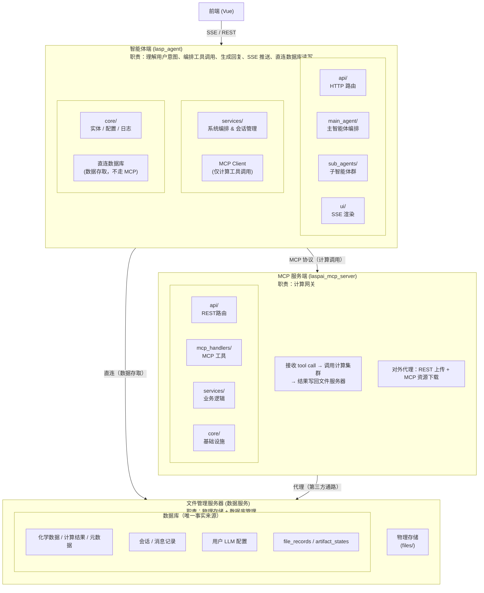
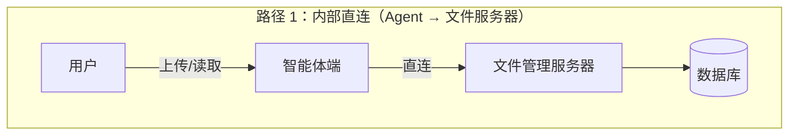
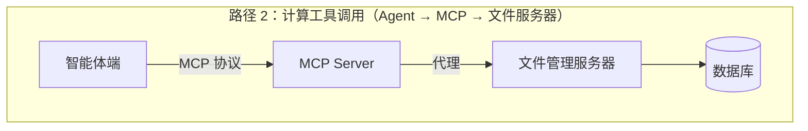
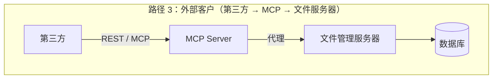

# LASPAI 智能体系统总体设计方案

本文档描述 LASPAI 智能体项目的整体架构设计，涵盖智能体端、MCP 服务端、文件管理服务器和数据库四大部分的分工与协作。

---

## 一、项目定位

LASPAI 智能体是一个面向材料科学的 AI 智能体系统，核心能力包括：

- **计算建模**：通过自然语言驱动分子生成、晶体结构搜索、表面建模、吸附构型优化、分子动力学、全局优化、性质计算等化学计算任务
- **RAG 问答**：基于知识库文档的智能问答

系统采用**四层解耦架构**，将「智能编排」「计算执行」「数据存储」「文件管理」彻底分离。

---

## 二、总体架构



---

## 三、四部分职责

### 3.1 智能体端（`lasp_agent/`）

| 维度           | 说明                                                          |
| -------------- | ------------------------------------------------------------- |
| **核心职责**   | 理解用户意图、编排工具调用、生成回复、SSE 推送                |
| **数据存取**   | **直连文件管理服务器**读写所有数据（内部通路，不走 MCP）      |
| **计算调用**   | 通过 `MCPClient` → MCP Server 调用计算工具                    |
| **状态持久化** | 自定义 LangGraph checkpointer（覆盖模式）+ 业务数据库定时快照 |
| **日志追踪**   | OpenTelemetry + W3C `traceparent` 全链路                      |
| **技术栈**     | FastAPI + LangGraph + MCP SDK (client) + SQLModel             |

> 详细设计见 → [LASPAI 智能体端设计方案](./LASPAI%20智能体端设计方案.md)

### 3.2 MCP 服务端（`laspai_mcp_server/`）

| 维度           | 说明                                                                 |
| -------------- | -------------------------------------------------------------------- |
| **核心职责**   | 计算网关：暴露标准化计算工具、调度计算集群                            |
| **对智能体端** | 提供 MCP 工具列表供 LLM function calling 使用                        |
| **对外部客户** | 代理文件上传/下载（REST + MCP resource），不直连文件服务器            |
| **鉴权**       | SSE 连接时校验 Token，`user_id` 注入 `contextvars`，实现底层权限隔离 |
| **技术栈**     | FastAPI + MCP SDK (server) + SQLModel                                |

> 详细设计见 → [LASPAI MCP Server 设计方案](./LASPAI%20MCP%20Server%20设计方案.md)

### 3.3 文件管理服务器（数据服务）

| 维度         | 说明                                                                           |
| ------------ | ------------------------------------------------------------------------------ |
| **核心职责** | 数据服务：物理文件存储 + 数据库管理（file_records + 业务表 + artifact_states） |
| **对智能体端** | 直连访问，一次调用完成上传/下载/查询                                          |
| **对 MCP 端** | 接收代理请求（第三方通路），计算完成后回写 artifact_states                     |
| **存储方案** | `files/{user_id}/{file_id}.{ext}` 本地文件系统平铺                             |
| **去重**     | SHA256 哈希，同文件只存一份                                                    |
| **技术栈**   | Python + SQLAlchemy                                                  |

> 详细设计见 → [LASPAI 智能体文件管理端设计方案](./LASPAI%20智能体文件管理端设计方案.md)

### 3.4 数据库

| 维度         | 说明                                                                                     |
| ------------ | ---------------------------------------------------------------------------------------- |
| **定位**     | 唯一事实来源，由文件管理服务器统一管理，Agent 内部直连、第三方经 MCP 代理                |
| **DBMS**     | MySQL（与网站本体共享实例），通过人工手写 SQL 脚本管理 schema 迁移                  |
| **存储内容** | agent_users、conversations、messages、tool_calls、llm_configs、artifact_states、file_records |
| **访问方式** | 智能体端直连（内部通路）；MCP 服务端代理（第三方通路）                                   |

> 详细设计见 → [LASPAI 智能体数据库设计方案](./LASPAI%20智能体数据库设计方案.md)

---

## 四、数据流

### 4.1 计算任务流程（用户 → 结果）

```text
1. 用户上传结构文件
   前端 → POST /api/agent/chat/{session_id}
   └→ 智能体端 → 文件管理服务器：upload_and_register(...)
      └→ 写入物理文件 + file_records + artifact_states
      └→ 返回 string_id（如 "crys_abc123"）

2. 主智能体编排
   主智能体 LLM 分析用户意图，决定调用 crys_agent
   └→ router_node 构造 SubAgentInput(resource_ids=["crys_abc123"])

3. 子智能体执行
   crys_agent init_node：通过文件管理服务器读取结构内容
   crys_agent planner_node：LLM 制定执行计划
   crys_agent gen_opt_node：
     └→ mcp_client.call_tool("crystal_gen_opt", {"string_id": "crys_abc123"})
        └→ MCP Server：通过文件服务器读取结构 → 调用计算集群
        └→ 结果写回文件服务器 → 返回 {"status": "success", "string_id": "crys_def456", ...}

4. 结果回传
   crys_agent pack_node：LLM 生成描述，构造 Artifact(string_id="crys_def456", ...)
   └→ post_process_node：注册到 inventory，ToolMessage 回执
   └→ 回到 LLM_node，LLM 可继续操作或回复用户
```

### 4.2 数据访问路径







---

## 五、目录结构

> 为防止多处维护导致不一致，各模块的目录结构定义已统一下放到各自的说明文档中：

| 模块 | 目录结构参见 |
|------|------------|
| 智能体端 | [LASPAI 智能体端设计方案 §二](./LASPAI%20智能体端设计方案.md) |
| MCP 服务端 | [LASPAI MCP Server 设计方案 §二](./LASPAI%20MCP%20Server%20设计方案.md) |
| 文件管理服务器 | [LASPAI 智能体文件管理端设计方案 §一](./LASPAI%20智能体文件管理端设计方案.md) |

数据库表由 SQLAlchemy ORM 创建，迁移使用人工手写 SQL 脚本。

---

---

## 六、关键技术决策

| 决策             | 选择                              | 说明                                                                                    |
| ---------------- | --------------------------------- | --------------------------------------------------------------------------------------- |
| 四层拆分         | 智能体端 / MCP 服务端 / 文件管理服务器 / 数据库 | 编排、计算、数据服务、存储彻底解耦                                                       |
| 智能体端数据存取 | **直连文件管理服务器**            | 内部使用时一次调用完成，不走 MCP，减少网络开销                                           |
| MCP 协议边界     | **仅计算工具调用**                | MCP 只传计算指令和返回 string_id，不传文件内容                                          |
| 数据库管理       | 文件管理服务器统一管理            | 物理文件 + 元数据同生命周期，Agent 直连、第三方经 MCP 代理                               |
| 对外数据存取     | MCP Server 代理                   | MCP 原生缺上传接口，第三方通过 MCP 资源接口间接访问文件服务器                            |
| 子智能体图结构   | 各自独立                          | mol_agent 画板中断等个性化流程不可强行统一                                              |
| 节点执行模型     | 全部 async                        | MCP 调用为异步 I/O                                                                      |
| Checkpointer     | 自定义覆盖模式                    | 替代 LangGraph 原生追加模式                                                             |
| 短 ID 机制       | `{type}_{random}`                 | 由文件管理服务器生成，防 LLM 幻觉，节省 Token                                            |
| 全链路追踪       | OpenTelemetry + W3C `traceparent` | 自动插桩无侵入；跨服务标准透传；暂不部署 APM；Span Attributes 绑定 user_id + session_id |
| 问答知识库       | `ask_service/data/`               | 物理隔离计算数据                                                                        |
| 文件去重         | SHA256                            | 同文件只存一份，多个 artifact_state 共享同一 file_server_id                             |

---

## 七、协作协议

### 7.1 智能体端 ↔ 文件管理服务器（内部直连）

智能体端所有数据操作通过文件管理服务器一步完成：

```text
智能体端                                          文件管理服务器
───────                                          ──────────────
upload_and_register(user_id, content, ...) ───▶ 写物理文件 + file_records + artifact_states
                                                    → 返回 string_id
download_by_string_id(string_id)           ───▶ 查 artifact_states → 查 file_records
                                                    → 读物理文件 → 返回 bytes
```

### 7.2 智能体端 ↔ MCP 服务端（计算调用）

```text
智能体端                                          MCP 服务端
───────                                          ──────────
MCPClient.list_tools()         ───────────────▶ 返回工具列表（名称 + JSON Schema）
MCPClient.call_tool(name, args) ───────────────▶ 调度计算集群 → 结果写回文件服务器
                                                   → 返回 {status, string_id, metadata}
                      Header: traceparent: 00-{trace_id}-{span_id}-01  → 继承 trace context
```

### 7.3 MCP 服务端 ↔ 文件管理服务器（代理通路）

```text
MCP 服务端                                          文件管理服务器
──────────                                          ──────────────
代理上传（第三方请求）      ────────────────────▶ upload_and_register(...) → 返回 string_id
代理下载（第三方请求）      ────────────────────▶ download_by_string_id(...) → 返回 bytes
计算完成后写入              ────────────────────▶ upload_and_register(..., source="computation")
```

---

> **关联文档**：
> - [LASPAI 智能体端设计方案](./LASPAI%20智能体端设计方案.md)
> - [LASPAI MCP Server 设计方案](./LASPAI%20MCP%20Server%20设计方案.md)
> - [LASPAI 智能体文件管理端设计方案](./LASPAI%20智能体文件管理端设计方案.md)
> - [LASPAI 智能体数据库设计方案](./LASPAI%20智能体数据库设计方案.md)
